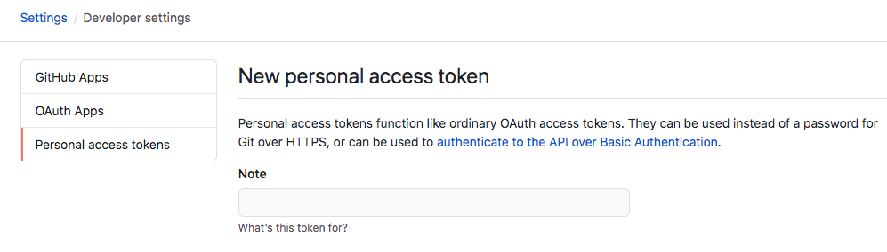
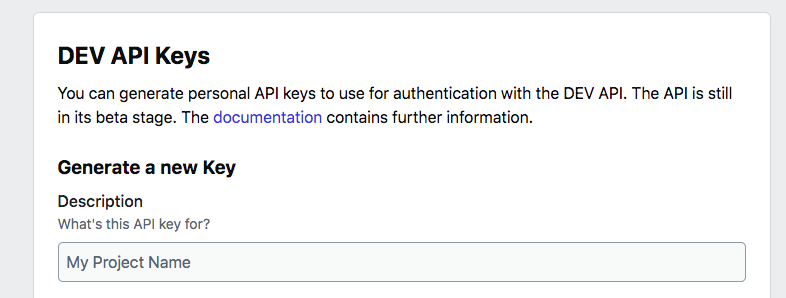
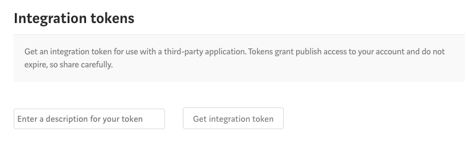

# MD-Gist - a .net core tool to transform your markdown code with gist

> This is a markdown tool to transform markdown codes to gist links, it will create gists from the embeded code blocks in your markdown blog posts. It saves embeded gist block in formats of dev.to, medium and hugo blogs. You can also publish your markdown post to dev.to and medium as well.


**Pre-request**

- .Net Core 3.1
- Github auth token
- Medium auth token (Optional, for publishing)
- Dev.to apikey (Optional, for publishing)

## Table of Contents

- [Features](#features)
- [Installation](#installation)
- [Support](#support)
- [License](#license)

## Features

> You can manage your blog posts in a github repository with markdown formats. And use these blogs to transform it with gist for better publishing.

- parse command
    Discover mardown files for specified folder and transform all code blocks into gist link. It requires you to specify github auth token to create cosresponding gist files.

    First you need to create a github access token.

    To create the token, go to [Github Create Access Token](https://github.com/settings/tokens/new)
    

    And make sure you select the Gist scope.

    
    
``` bash
$ md-gist parse -f=<Path> -t=<Github_Auth_Token>
```

    If the command successfully run, you would see a number of generated `.md` files. e.g.

```
create-dotnet-core-console-app-with-autofac-dependency-injection-[Dev.to].md
create-dotnet-core-console-app-with-autofac-dependency-injection-[Hugo].md
create-dotnet-core-console-app-with-autofac-dependency-injection-[Medium].md
create-dotnet-core-console-app-with-autofac-dependency-injection-[Jekyll].md
create-dotnet-core-console-app-with-autofac-dependency-injection.md
```
If you open any of them, you should see all the code blocks are replaced with a gist link (or embeded code).

e.g. 

for Hugo blog, it replaces the code blocks as

```

```

for Dev.to, it replaces as,

```

```

for Medium, it simply replaces as a gist link (when publishing to medium as markdown format, it will convert to proper embeded block)

```
https://gist.github.com/superwalnut/b92434xxx8301cab0c28d3cf34d08
```

for jekyll, it replaces as,

```

```

- devto command
    Use this to publish your post to Dev.to blog

    First you need to create dev.to api keys in your [account settings](https://dev.to/settings/account)

     


```
$ md-gist devto -f=<Files Path> -k=<Dev.to API key> -s=<Status draft/publish>
```

- medium command
    Use this to publish your post to Medium

    First you need to create medium integration token in [account settings](https://medium.com/me/settings)

    
```
$ md-gist medium -f=<Files Path> -t=<Medium Access Token> -s=<Status draft/publish>
```

## Installation

- Using `dotnet tool install --global MD-Gist` to install the console tool from nuget 

``` shell
$ dotnet tool install --global MD-Gist
```

---

## Support

Reach out to me at one of the following places!

- [Follow me @ Github](https://github.com/superwalnut)

- [Twitter](https://twitter.com/superwalnuts)

- [](https://ko-fi.com/Z8Z61I9HB)

---

## License

[](http://badges.mit-license.org)

- **[MIT license](http://opensource.org/licenses/mit-license.php)**

-------